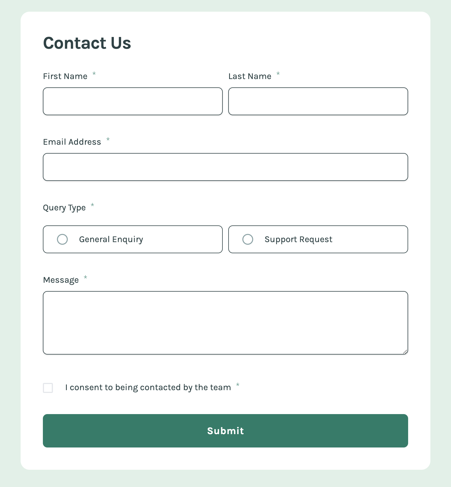

# Frontend Mentor - Contact form solution

This is a solution to the [Contact form challenge on Frontend Mentor](https://www.frontendmentor.io/challenges/contact-form--G-hYlqKJj). Frontend Mentor challenges help you improve your coding skills by building realistic projects. 

## Table of contents

- [Overview](#overview)
  - [The challenge](#the-challenge)
  - [Screenshot](#screenshot)
  - [Links](#links)
- [My process](#my-process)
  - [Built with](#built-with)
  - [What I learned](#what-i-learned)
  - [Continued development](#continued-development)
  - [Useful resources](#useful-resources)
- [Author](#author)


## Overview

### The challenge

Users should be able to:

- Complete the form and see a success toast message upon successful submission
- Receive form validation messages if:
  - A required field has been missed
  - The email address is not formatted correctly
- Complete the form only using their keyboard
- Have inputs, error messages, and the success message announced on their screen reader
- View the optimal layout for the interface depending on their device's screen size
- See hover and focus states for all interactive elements on the page

### Screenshot




### Links

- [Solution URL](https://github.com/edpau/fm_contact-form)
- [Live Site URL](https://edpau.github.io/fm_contact-form/)

## My process

### Built with

- Semantic HTML5 markup
- CSS custom properties
- CSS Grid
- Mobile-first workflow
- Tailwind CSS
- [React](https://reactjs.org/) - JS library
- React Hook Form


### What I learned

#### Tailwind peer

##### What I want to do
- I am trying to use SVG to replace the default radio button to give my webpage a consistent look across different browser. 
- I want the SVG outer circle to grey out when it is not clicked
- when the radio button is clicked (in my case, it is the label, I wrapped the label around the radio button), then colored when it is clicked

##### SVG I used
- This SVG has separate into parts for better control
```js
<svg
                className="mr-3 opacity-0 peer-checked:opacity-100 absolute"
                fill="currentColor"
                preserveAspectRatio="xMidYMid meet"
                height="1.25rem"
                width="1.25rem"
                viewBox="0 0 34 34"
                aria-hidden="true"
                focusable="false"
              >
                <circle
                  className="radioOutline"
                  cx="17"
                  cy="17"
                  r="15"
                  fill="none"
                  stroke="black"
                  stroke-width="3"
                />
                <circle className="" cx="17" cy="17" r="9" fill="red" />
              </svg>
```

##### What I read and try
- I read [Inclusively Hiding & Styling Checkboxes and Radio Buttons](https://www.sarasoueidan.com/blog/inclusively-hiding-and-styling-checkboxes-and-radio-buttons/) and learn to use opacity 0 over visibility for better accessibility.
  - using opacity 0 over sr-only can improve accessibility for users navigating by touch
  - Both display: none and visibility: hidden remove the element they hide from the DOM and accessibility tree

- I learnt from this two code pen, using Vanilla CSS to style the SVG when the checkbox/ Radio button is clicked. Their SVG has separate into parts for better control using class name
  - [#PracticalA11y: Inclusively-hidden custom-styled checkbox](https://codepen.io/SaraSoueidan/pen/BajzpEr)
  - [CodePen Home
Radio Button with SVG](https://codepen.io/kilgarenone/pen/LBXezO)

  - SVG example 
  ```js
  <svg class="svg" fill="currentColor" preserveAspectRatio="xMidYMid meet" height="34px" width="34px" viewBox="0 0 34 34">
      <circle class="radioOutline" cx="17" cy="17" r="15" fill="none" stroke="black" stroke-width="3" />
      <circle class="radioDot" cx="17" cy="17" r="9" fill="red" />
  </svg>
  ```
  - using Vanilla CSS to style the SVG when it is checked
  ```css
  input:checked + svg {
      .radioDot,
      .radioOutline {
        opacity: 1;
      }
    }
  ```

- I also learn from this example, [Custom Radio Buttons with only Tailwind CSS](https://play.tailwindcss.com/f6zsuCPdwj), this example taught me to use Tailwind peer.
  -  In Tailwind CSS, the peer-checked class can style elements that are siblings of the peer element when the peer element is checked.
  - example on using peer
  ```js
    <input type="radio" class="peer sr-only" name="pricing" />
    <div class=" peer-checked:text-sky-600 peer-checked:ring-blue-400 peer-checked:ring-offset-2">
    ```

##### Problem I have
- I cannot control individual parts of the SVG using Tailwind
- The peer-checked class will not work in my case because the <circle> element is not a direct sibling of the input element.
- In Tailwind CSS, I cannot directly target sibling elements with complex selectors like input:checked + svg .radioDot because Tailwind CSS is a utility-first CSS framework that generates utility classes for individual elements. 

 ```css
  input:checked + svg {
      .radioDot,
      .radioOutline {
        opacity: 1;
      }
    }
  ```

##### How I solve it

- I used a similar approach as [https://marek-rozmus.medium.com/styling-checkbox-with-tailwind-46a92c157e2d](https://marek-rozmus.medium.com/styling-checkbox-with-tailwind-46a92c157e2d)
- I put two SVG on top of each other and change their opacity.

#### Loading Custom fonts

```css
@tailwind base;
@tailwind components;
@tailwind utilities;

@layer base {
  @font-face {
    font-family: "Karla";
    src: url("./assets/fonts/Karla-VariableFont_wght.ttf") format("truetype");
    font-weight: 100 900;
    font-style: normal;
    font-display: swap;
  }
  html {
    font-family: "Karla", "sans-serif";
    font-style: normal;
    font-weight: 500;
  }
  body {
    background-color: hsl(148, 38%, 91%);
  }
}
```

##### Performance consider
- Loading custom fonts can indeed impact the performance of your website, especially if the fonts are large or if there are many of them.
1. Preload Fonts: Use the <link rel="preload"> tag in your HTML to preload the fonts. This tells the browser to fetch the fonts as soon as possible. (put in main.tsx)
`<link rel="preload" href="./assets/fonts/Karla-VariableFont_wght.ttf" as="font" type="font/ttf" crossorigin="anonymous">`

2. Font Display Property: Use the font-display property in your @font-face rule to control how the font is displayed while it is loading. The `font-display: swap;` property ensures that the text is displayed using a fallback font until the custom font is loaded, reducing the perceived load time.

#### [Styling Forms with Tailwind CSS](https://www.youtube.com/watch?v=pONeWAzDsQg)

1. w-full
2. focus:outline-none
3. focus:border-indigo-500

#### Change the input border color to red when the input is invalid
- To change the input border color to red when the input is invalid using react-hook-form and Tailwind CSS, I conditionally apply Tailwind utility classes based on the presence of validation errors.

```js
<input
            className={`${errors.firstName ? "border-error" : "border-neutral"}`}
          />
  ```

#### Avoid layout shifts when display error

- preventing layout shifts by reserving the necessary space
- Method 1
```js
<p role="alert" className={`text-error min-h-[2rem] ${errors.firstName ? "visible" : "invisible"}`}>{errors.firstName?.message}</p>
```

-Method 2
```js
<p role="alert" className={`text-error ${errors.firstName ? "visible" : "invisible"}`}>{errors.firstName ? errors.firstName?.message : "no error"}</p>
```

#### [The animationend event](https://developer.mozilla.org/en-US/docs/Web/API/Element/animationend_event) 
- The animationend event is fired when a CSS Animation has completed.
- I used to set the SuccessPopup state to false after the animation end, rather than using setTimeout. 
- onAnimationEnd Callback: I added the onAnimationEnd prop to SuccessPopup, which triggers setShowSuccess(false) only after the animation completes. This removes the need for a setTimeout and makes timing adjustments easier.
- CSS-Only Animation Management: The animation manages the entire lifecycle of the popup (show, hold, and fade-out). Now, changing the animation duration or style in CSS won’t require adjusting JavaScript timing.
- This approach is more maintainable and reduces re-rendering since the parent component doesn’t rely on setTimeout for toggling showSuccess, improving the user experience and performance.

##### setTimeout 
```js
  const onSubmit: SubmitHandler<FormValues> = (data) => {
    console.log(data);
    setShowSuccess(true);
    setTimeout(()=>setShowSuccess(false), 5000)
  };
```

##### animationend

- SuccessPopup Component

```js 
function SuccessPopup({ onAnimationEnd }: SuccessPopupProps) {
  return (
    <>
      <aside
        role="alert"
        className=" animate-slideIn"
        onAnimationEnd={onAnimationEnd} // Callback triggered when animation ends
      >
      // ...
  )}
```

- Parent Component

```js 
function Form() {
  // ...

  const [showSuccess, setShowSuccess] =useState<boolean>(false);

  const onSubmit: SubmitHandler<FormValues> = (data) => {
    console.log(data);
    setShowSuccess(true);
  };

  const selectedQueryType: string = watch("queryType");


  return (
    <>
    {
      showSuccess && <SuccessPopup onAnimationEnd={()=> setShowSuccess(false)}/>
    }

  //  ...
)}
```

#### input attribute- autoComplete

### Continued development

#### Simulate error status, 

- Make a loading state and handle error

```js
  const onSubmit: SubmitHandler<FormValues> = (data) => {
    console.log(data);

    return new Promise((resolve, reject) => {
      setTimeout(() => {
        console.log("Form submission failed");
        reject(new Error("Form submission failed"));
      }, 2000); // Simulate a 2-second delay
    });
  };
```

#### improve accessibility 
- need to provide more feedback when user didn't fill in data, reference [Grace Snow example](https://www.frontendmentor.io/solutions/my-first-react-and-tailwind-challenge-qnysYFwgR9)

### Useful resources

#### React Hook Form 
- [How to change style to input in a React hook form?](https://stackoverflow.com/questions/71203296/how-to-change-style-to-input-in-a-react-hook-form)
- [React Hook Form Validation with Complete Examples](https://refine.dev/blog/react-hook-form-validation-examples/#form-submission)
- [React Hook Form- Form builder](https://react-hook-form.com/form-builder)

#### Accessibility
- [Indicating form controls as required using asterisks (*)](https://www.accessibility-developer-guide.com/examples/forms/required/) - Instead of trying to hide the plain text asterisk * in the label, we replace it with a decent icon.
- [Accessibility first: radio buttons](https://dev.to/link2twenty/accessibility-first-radio-buttons-2302) 

#### SVG
- [How To Define SVG Content for Reuse — The defs, symbol, And use Elements](https://vanseodesign.com/web-design/svg-definition-reuse/)
- [Required input with asterisks as icons](https://codepen.io/edpau/pen/ExqLYqW) - The SVG * is used to define and reuse an icon that indicates a required field in accessibility way

#### Radio button to SVG
- [Form with SVG radio buttons](https://codepen.io/AngelaVelasquez/pen/BWXbxP)
- [Radio Button with SVG](https://codepen.io/kilgarenone/pen/LBXezO)
- [How to change checkbox color in CSS and SVG](https://blog.adobe.com/en/publish/2015/08/26/css-vs-svg-styling-checkboxes-and-radio-buttons)
- [Styling radio button with Tailwind](https://marek-rozmus.medium.com/styling-radio-button-with-tailwind-6e16d6c0d68d) - make radio button from scratch
- [Custom Radio Buttons with only Tailwind CSS](https://www.youtube.com/watch?v=HxMGchwVVBU)
-[Radio Button with SVG](https://codepen.io/kilgarenone/pen/LBXezO) change color in svg radio button
= [Simple Standard Radio Button with SVG](https://walaoeh.medium.com/radio-button-in-svg-aa662fa63d9d)

#### Checkboxes
- [Styling checkboxes and radio buttons](https://www.30secondsofcode.org/css/s/custom-checkbox-radio/) -mgood css example using SVG
- [Styling checkbox with Tailwind](https://marek-rozmus.medium.com/styling-checkbox-with-tailwind-46a92c157e2d)

#### Form
- [HTML attribute: autocomplete](https://developer.mozilla.org/en-US/docs/Web/HTML/Attributes/autocomplete) - provide automated assistance in filling out form field values i.e. `autoComplete="given-name"`
- [Accessibility good form example](https://www.accessibility-developer-guide.com/examples/forms/good-example/_examples/generally-good-form/)

#### Material Tailwind
- [Tailwind CSS Checkbox](https://www.material-tailwind.com/docs/html/checkbox)

## Author

- Website - [Edward Pau](https://www.edpau.me)
- Frontend Mentor - [@edpau](https://www.frontendmentor.io/profile/edpau)
